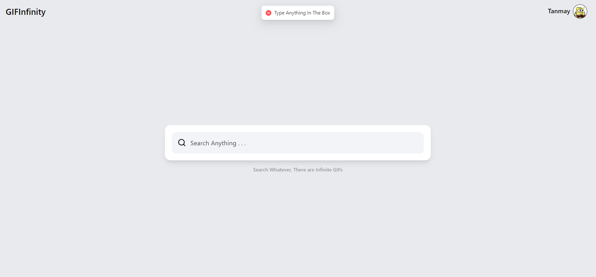
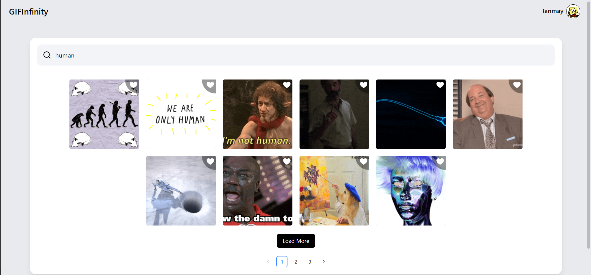
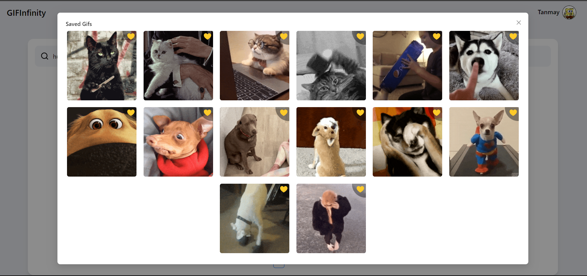
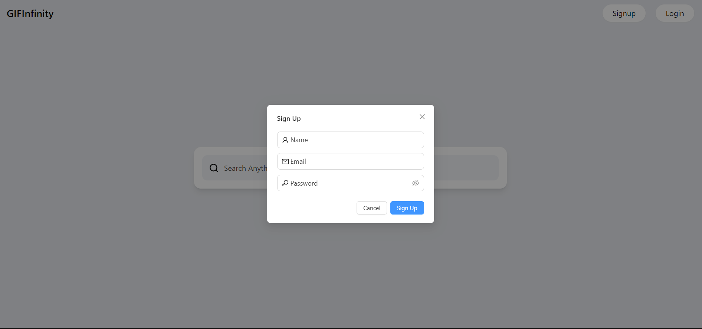

# Initiating the project : 2.30 PM - 10 nov 2023

> With a large discussion with chatGPT I find the name of my project - GIFInfinity. and starting the app of NEXT.js - 1st commit

# Features

1. Authentication with Firebase - Email & Password
2. Updatability of details
3. Giphy Api search
4. Hot Search
5. Pagination
6. Loading
7. Smooth animation
8. Better User Experience
9. Sharing GIF
10. Saving Favourite
11. Trending 20 GIFs

# Used Libraries

1. firebase
2. ant design
3. zustand
4. framer motion
5. giphy fetch api
6. next

# Env Instruction
>The keys and values needed are not there please create a local env file and put there the required details like firebase details and giphy api key

# Some Screenshots

